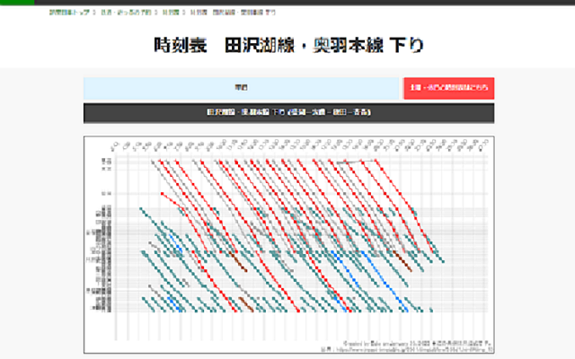
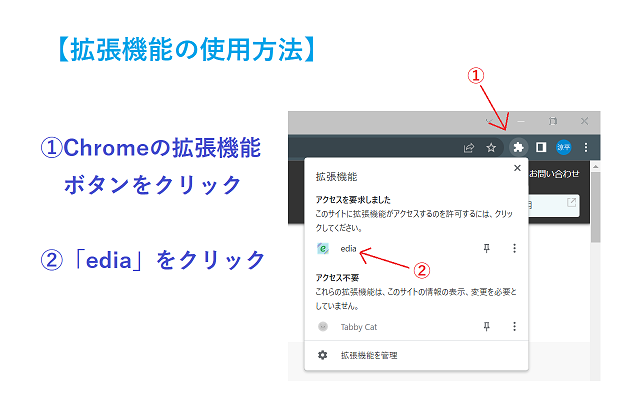

# edia

[](https://github.com/ayame113/edia/actions/workflows/test.yml)
[](https://codecov.io/github/ayame113/edia)

時刻表をChart.jsによるダイヤグラムに変換します。

- ライブラリ：https://deno.land/x/edia
- ドキュメント：https://deno.land/x/edia/lib/mod.ts
- 拡張機能:
  https://chrome.google.com/webstore/detail/edia/nggncccbpkmeojkfmhjjjimbfppfbgbe/related?hl=ja




```ts
import { generateDiagram } from "https://deno.land/x/edia@$MODULE_VERSION/lib/mod.ts";

const table = document.querySelector(".paper_table");
const el = await generateDiagram(table as HTMLTableElement);
document.body.insertAdjacentElement("afterbegin", el);
```

### ディレクトリ構成

- `.vscode/`: vscode設定ファイル。
- `build/`: TypeScriptビルド関連。
- `etension/`: Chrome拡張用ファイル。
- `lib/`: ライブラリ。
- `deno.json`: Deno設定ファイル。
- `manifest.json`: Chrome拡張設定ファイル。

### 開発

[Deno](https://deno.land/)をインストールする必要があります。

```shell
# TypeScriptをビルドしてjsファイルを生成
> deno task build
# TypeScriptをビルドしてjsファイルを生成（ファイル変更の度に自動生成）
> deno task build:watch
# TypeScriptがビルド結果が最新かどうかチェック
> deno task build:check
# テストを実行
> deno task test
```
